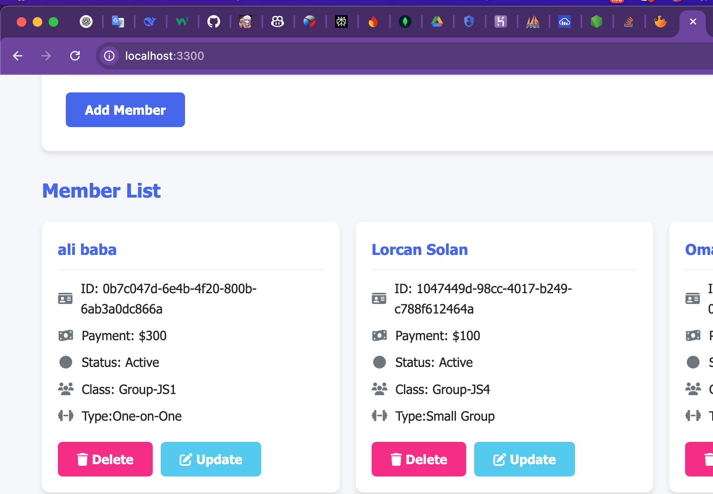

# Gym Membership Management System 🏋️‍♂️
### Lorcan Solan😐:

This is a full-stack web application built using **Node.js**, **Express**, **MySQL**, and **EJS** to manage gym members, their payments, membership status, classes, and personal training plans. It also provides functionality to **add**, **view**, **update**, and **delete** member records through a clean user interface.

---

## 🧩 Features

- ✅ Add new gym members
- 🧾 Record payment details
- 🔁 Update membership status (active/expired)
- 👥 Assign group classes
- 🏆 Select personal training type
- 🗑️ Delete members
- ⚡ AJAX-powered updates without page reload
- 📋 View all members in a dynamic list

---

## 🛠️ Tech Stack

- **Backend**: Node.js, Express.js
- **Database**: MySQL
- **Frontend**: HTML, CSS, JavaScript
- **Templating**: EJS
- **Form Handling**: Express routes with body parsing
- **AJAX**: Vanilla JavaScript + `fetch()` for real-time updates

---

## 📦 Installation

### 1. Clone the Repository

```bash
git clone https://github.com/your-username/gym-membership-management.git
cd gym-membership-management


CREATE TABLE Management (
  id INT AUTO_INCREMENT PRIMARY KEY,
  name VARCHAR(100),
  Payment DECIMAL(10,2),
    status BOOLEAN DEFAULT TRUE,
  classes VARCHAR(100),
  type VARCHAR(100)
);
### add ur Information
const connection = mysql.createConnection({
  host: 'localhost',
  user: 'your_mysql_user',
  password: 'your_mysql_password',
  database: 'gym_db'
});

├── MYSQl/
│   └── mysql.ejs           
│   └── appSer.js     
│   └── information.md          

### 🧾 Member Form Page

